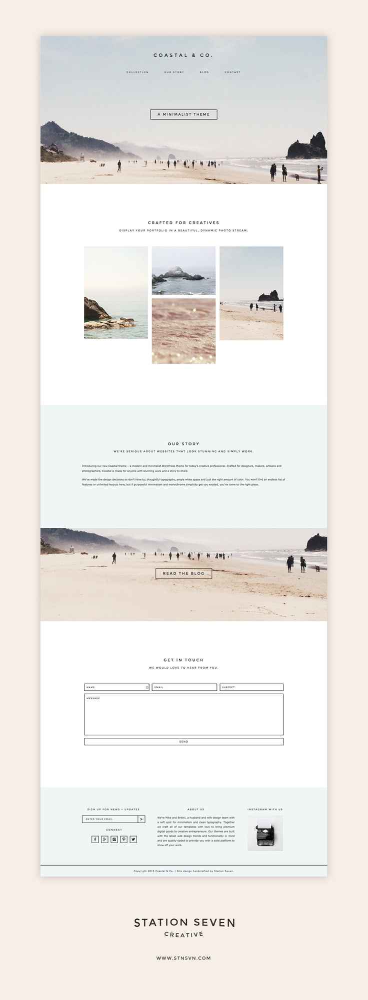

# WDIR-Hopper

---
Title: Mockup Using Floats and Calc 
Type: Morning Exercise 
Duration: "0:45" 
Creator: Matt Huntington 
    Modified by: Karolin Rafalski  
    Course: WDIR-Hopper  
Competencies: html fundamentals css fundamentals  
Prerequisites:  
[CSS Floats](https://www.youtube.com/watch?v=-4Yy3WNmvmg&list=PLdnONIhPScST0Vy4LrIZiYKpFNoxgyH7J&index=11) 
[CSS Calc](https://www.youtube.com/watch?v=nIHRRZe9xvs&list=PLdnONIhPScST0Vy4LrIZiYKpFNoxgyH7J&index=12) 

## Create This Mockup With Only display:block; Elements

1. Copy just your `.html` file  and images from yesterday (from terminal use `*.html` and `*.jpg` (or whatever image extension you used) to copy `cp` your files to this directory. 
    1. Start your css file from scratch. This time use what you learned about floats and calc:
    1. **DO NOT USE** `display:inline-block;` **OR** `display:inline;` **AT ALL.  USE ONLY** `display:block;` **AND FLOATS.** Every element on the page must be have `display:block` assigned to it.
    1. Use `overflow:auto;` and `clear:left;`/`clear:right;`/`clear:both;` to clear any unnecessary floating problems.
    1. You do not have to use the exact photography in this mockup.  Feel free to find your own
        1. Do not worry about matching the fonts
    1. For the "GET IN TOUCH" section, do not worry about creating form elements for name, email, subject, message, send.  Just use standard elements that we've learned about (maybe divs?) and style them appropriately.
    1. You won't get it all done.  See how far you can get.

## Stretch:

1. Research form elements and add them in to match the mockup
1. Research fonts and find something that matches closely to the mockup
1. Finish the entire mockup!
