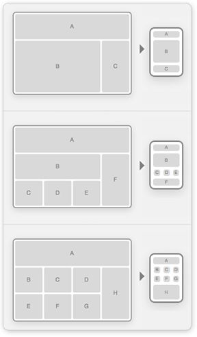

# WDIR-Hopper

---
Title: Mockup Using Floats and Calc 
Type: Morning Exercise 
Duration: "0:45" 
Creator: Matt Huntington 
    Modified by: Karolin Rafalski  
    Course: WDIR-Hopper  
Competencies: html fundamentals css fundamentals  
Prerequisites:  
[CSS Responsive Design](https://youtu.be/BsuCBmzLf_U?list=PLdnONIhPScST0Vy4LrIZiYKpFNoxgyH7J) 
[CSS Mobile First](https://youtu.be/iQIj7Lu64M4?list=PLdnONIhPScST0Vy4LrIZiYKpFNoxgyH7J) 
[CSS Media Queries](https://youtu.be/GYygtVolViM?list=PLdnONIhPScST0Vy4LrIZiYKpFNoxgyH7J) 

## Create These Mockups
1. 

## Stretch
Go back to the mockup from earlier in the week and give give it a responsive layout matching one of the above layouts
